## 40 EJERCICIOS SOLIDWORKS

Ejercicios Solidworks dejados al principio del curso

## Ejercicio 1
---

    <a href="../recursos/SOLID-BUENOS/Ejercicio%201%20Gerardo%20Esquivel.SLDPRT" target="_blank">[Descargar (SLDPRT)]</a>

---
## Ejercicio 2
---

    <a href="../recursos/SOLID-BUENOS/Ejercicio%202%20Gerardo%20Esquivel.SLDPRT" target="_blank">[Descargar (SLDPRT)]</a>

---
## Ejercicio 3
---

    <a href="../recursos/SOLID-BUENOS/Ejercicio%203%20Gerardo%20Esquivel.SLDPRT" target="_blank">[Descargar (SLDPRT)]</a>

---
## Ejercicio 4
---
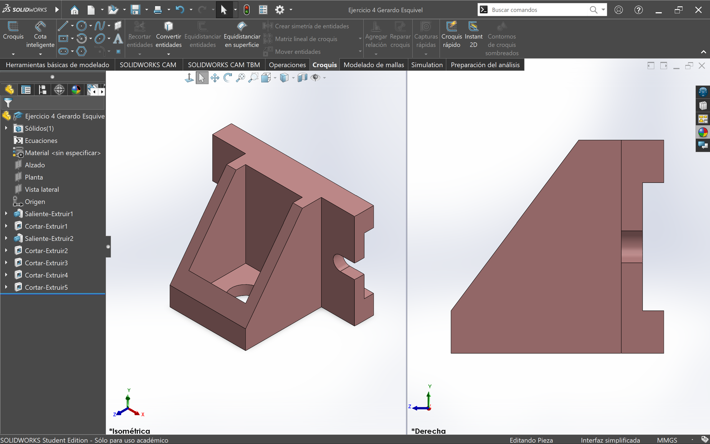

    <a href="../recursos/SOLID-BUENOS/Ejercicio%204%20Gerardo%20Esquivel.SLDPRT" target="_blank">[Descargar (SLDPRT)]</a>

---
## Ejercicio 5
---

    <a href="../recursos/SOLID-BUENOS/Ejercicio%205%20Gerardo%20Esquivel.SLDPRT" target="_blank">[Descargar (SLDPRT)]</a>

---
## Ejercicio 6
---
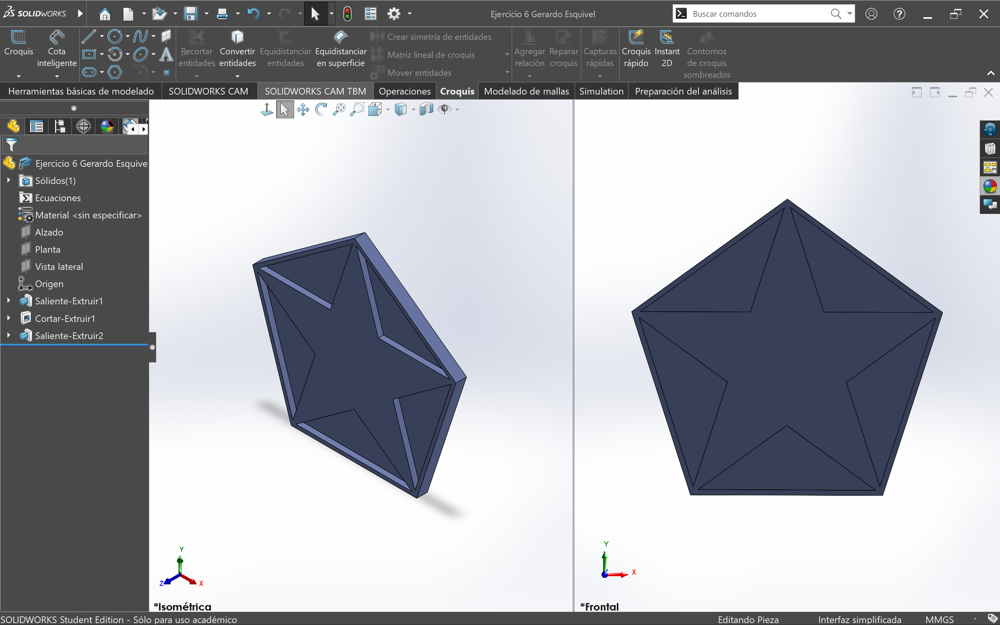

    <a href="../recursos/SOLID-BUENOS/Ejercicio%206%20Gerardo%20Esquivel.SLDPRT" target="_blank">[Descargar (SLDPRT)]</a>

---
## Ejercicio 7
---
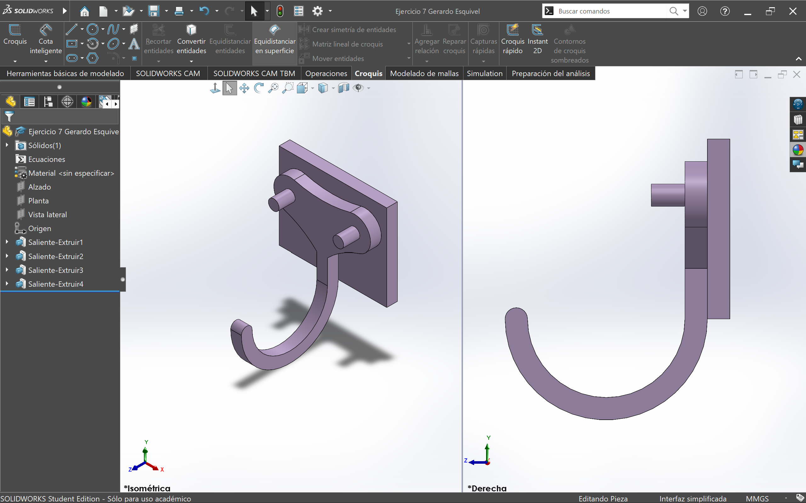

    <a href="../recursos/SOLID-BUENOS/Ejercicio%207%20Gerardo%20Esquivel.SLDPRT" target="_blank">[Descargar (SLDPRT)]</a>

--
## Ejercicio 8
---

    <a href="../recursos/SOLID-BUENOS/Ejercicio%208%20Gerardo%20Esquivel.SLDPRT" target="_blank">[Descargar (SLDPRT)]</a>

---
## Ejercicio 9
---
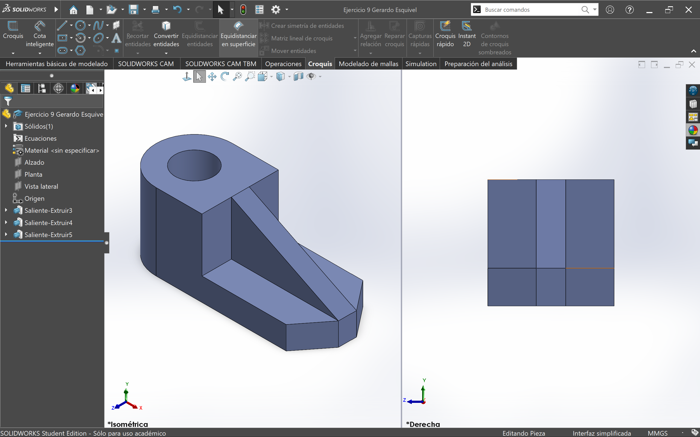

    <a href="../recursos/SOLID-BUENOS/Ejercicio%209%20Gerardo%20Esquivel.SLDPRT" target="_blank">[Descargar (SLDPRT)]</a>

---
## Ejercicio 10
---
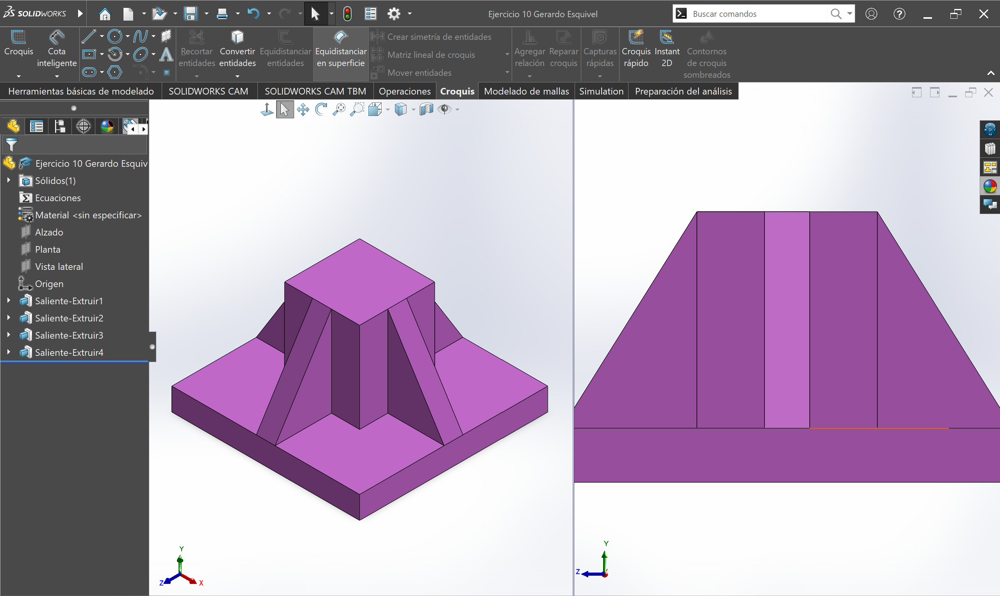

    <a href="../recursos/SOLID-BUENOS/Ejercicio%2010%20Gerardo%20Esquivel.SLDPRT" target="_blank">[Descargar (SLDPRT)]</a>

---
## Ejercicio 11
---
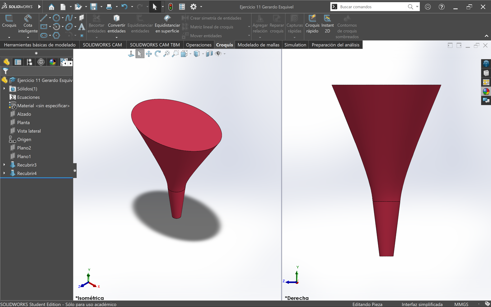

    <a href="../recursos/SOLID-BUENOS/Ejercicio%2011%20Gerardo%20Esquivel.SLDPRT" target="_blank">[Descargar (SLDPRT)]</a>

---
## Ejercicio 12
---
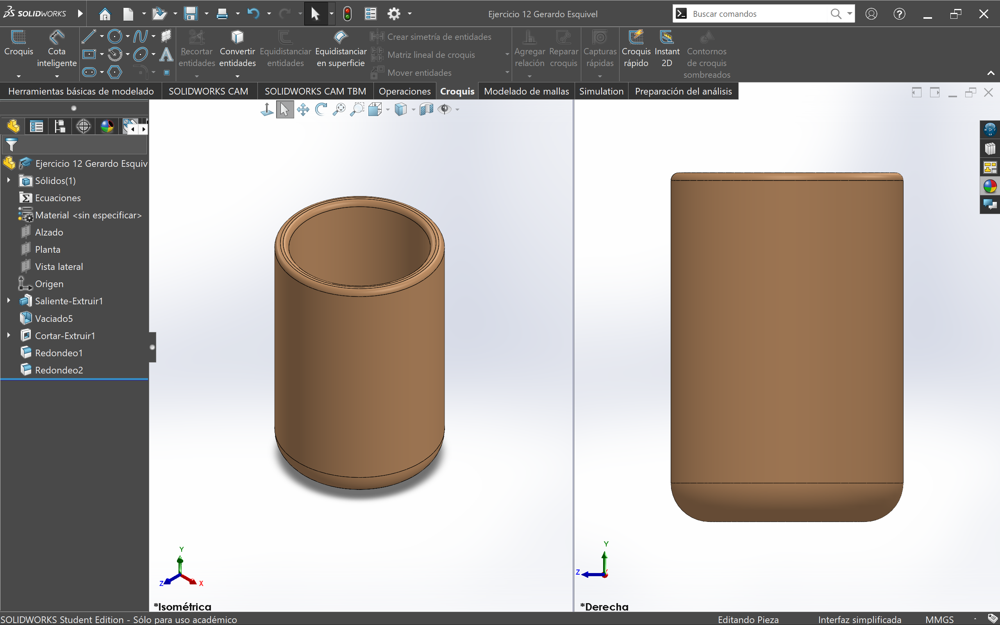

    <a href="../recursos/SOLID-BUENOS/Ejercicio%2012%20Gerardo%20Esquivel.SLDPRT" target="_blank">[Descargar (SLDPRT)]</a>

---
## Ejercicio 13
---

    <a href="../recursos/SOLID-BUENOS/Ejercicio%2013%20Gerardo%20Esquivel.SLDPRT" target="_blank">[Descargar (SLDPRT)]</a>

---
## Ejercicio 14
---

    <a href="../recursos/SOLID-BUENOS/Ejercicio%2014%20Gerardo%20Esquivel.SLDPRT" target="_blank">[Descargar (SLDPRT)]</a>

---
## Ejercicio 15
---
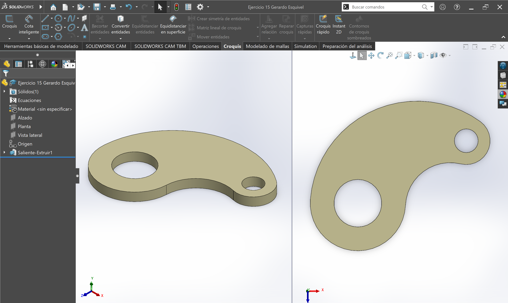

    <a href="../recursos/SOLID-BUENOS/Ejercicio%2015%20Gerardo%20Esquivel.SLDPRT" target="_blank">[Descargar (SLDPRT)]</a>

---
## Ejercicio 16
---

    <a href="../recursos/SOLID-BUENOS/Ejercicio%2016%20Gerardo%20Esquivel.SLDPRT" target="_blank">[Descargar (SLDPRT)]</a>

---
## Ejercicio 17
---
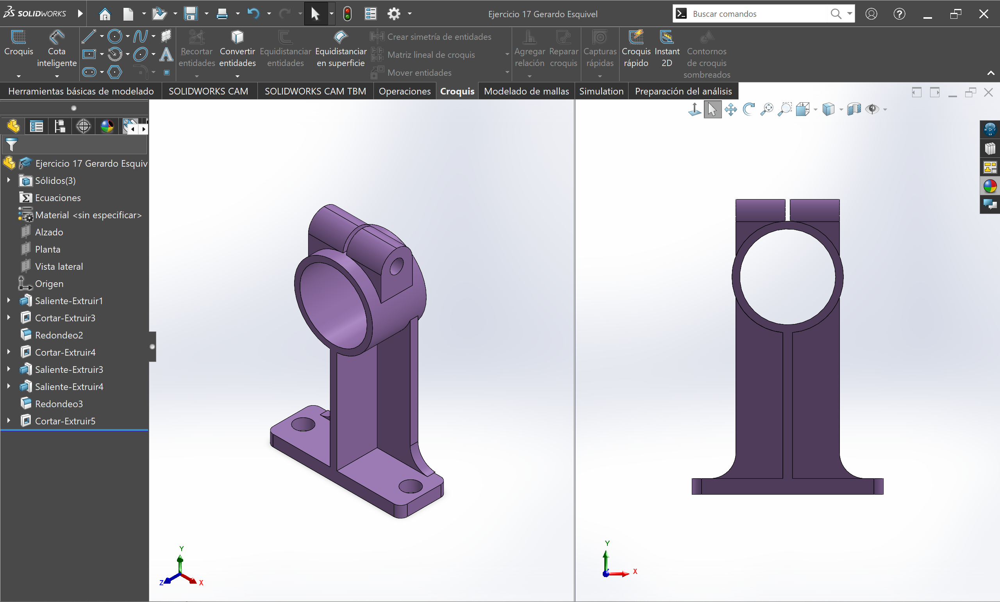

    <a href="../recursos/SOLID-BUENOS/Ejercicio%2017%20Gerardo%20Esquivel.SLDPRT" target="_blank">[Descargar (SLDPRT)]</a>

---
## Ejercicio 18
---
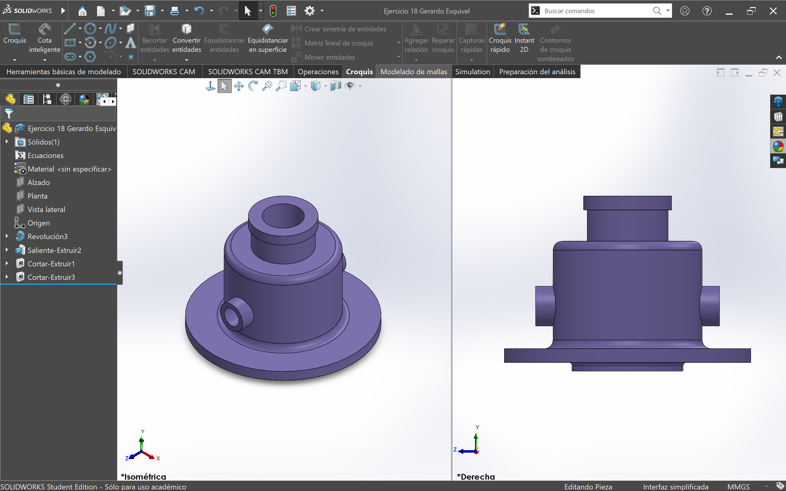

    <a href="../recursos/SOLID-BUENOS/Ejercicio%2018%20Gerardo%20Esquivel.SLDPRT" target="_blank">[Descargar (SLDPRT)]</a>

---
## Ejercicio 19
---
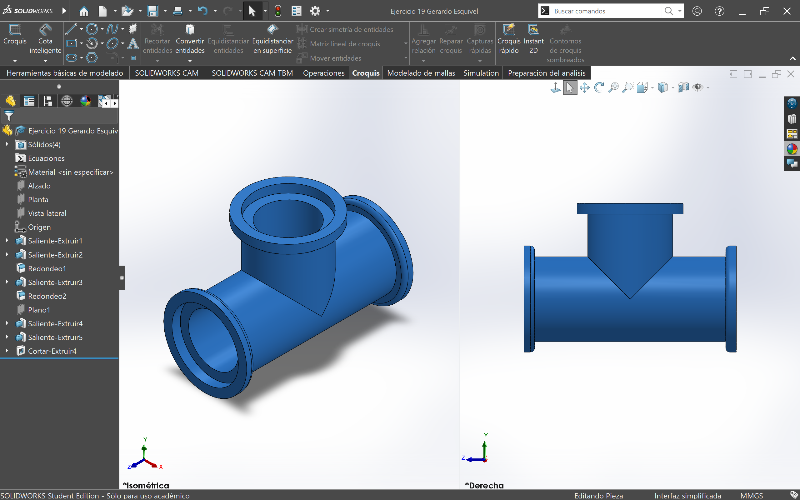

    <a href="../recursos/SOLID-BUENOS/Ejercicio%2019%20Gerardo%20Esquivel.SLDPRT" target="_blank">[Descargar (SLDPRT)]</a>

---
## Ejercicio 20
---
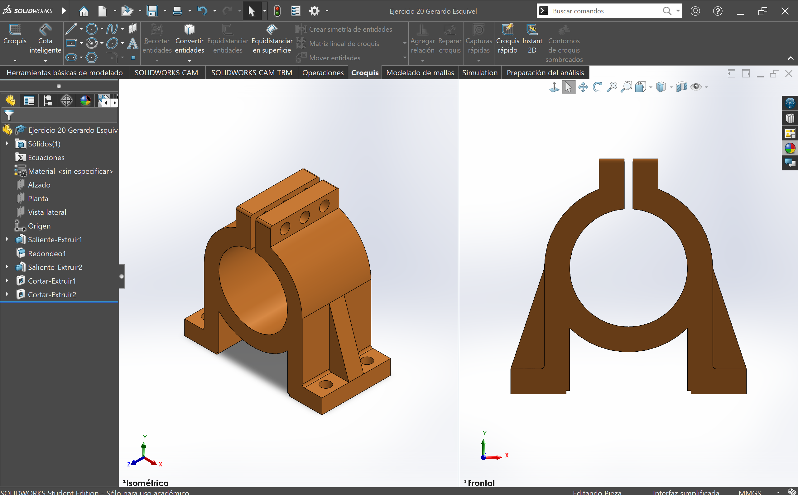

    <a href="../recursos/SOLID-BUENOS/Ejercicio%2020%20Gerardo%20Esquivel.SLDPRT" target="_blank">[Descargar (SLDPRT)]</a>

---
## Ejercicio 22
---
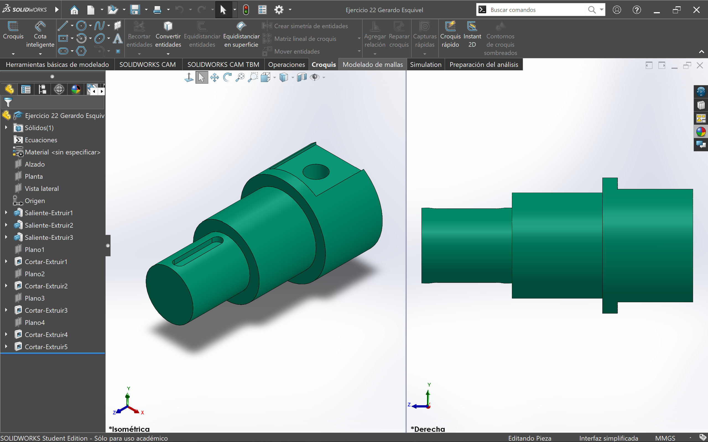

    <a href="../recursos/SOLID-BUENOS/Ejercicio%2022%20Gerardo%20Esquivel.SLDPRT" target="_blank">[Descargar (SLDPRT)]</a>

---
## Ejercicio 24
---
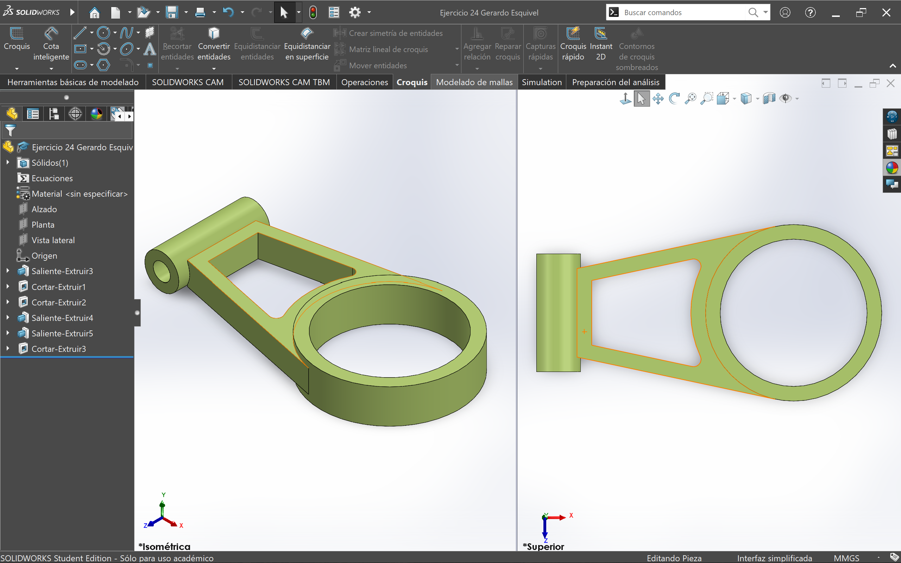

    <a href="../recursos/SOLID-BUENOS/Ejercicio%2024%20Gerardo%20Esquivel.SLDPRT" target="_blank">[Descargar (SLDPRT)]</a>

---
## Ejercicio 25
---

    <a href="../recursos/SOLID-BUENOS/Ejercicio%2025%20Gerardo%20Esquivel.SLDPRT" target="_blank">[Descargar (SLDPRT)]</a>

---
## Ejercicio 27
---

    <a href="../recursos/SOLID-BUENOS/Ejercicio%2027%20Gerardo%20Esquivel.SLDPRT" target="_blank">[Descargar (SLDPRT)]</a>

---
## Ejercicio 28
---

    <a href="../recursos/SOLID-BUENOS/Ejercicio%2028%20Gerardo%20Esquivel.SLDPRT" target="_blank">[Descargar (SLDPRT)]</a>

---
## Ejercicio 30
---

    <a href="../recursos/SOLID-BUENOS/Ejercicio%2030%20Gerardo%20Esquivel.SLDPRT" target="_blank">[Descargar (SLDPRT)]</a>

---
## Ejercicio 31
---

    <a href="../recursos/SOLID-BUENOS/Ejercicio%2031%20Gerardo%20Esquivel.SLDPRT" target="_blank">[Descargar (SLDPRT)]</a>

---
## Ejercicio 32
---
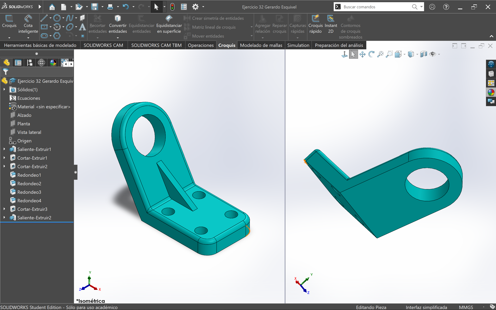

    <a href="../recursos/SOLID-BUENOS/Ejercicio%2032%20Gerardo%20Esquivel.SLDPRT" target="_blank">[Descargar (SLDPRT)]</a>

---
## Ejercicio 33
---
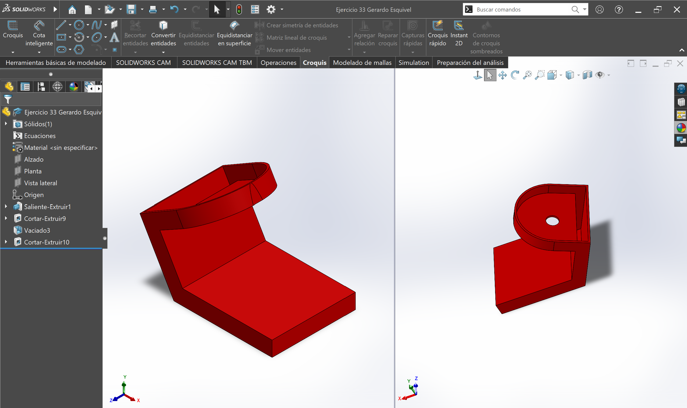

    <a href="../recursos/SOLID-BUENOS/Ejercicio%2033%20Gerardo%20Esquivel.SLDPRT" target="_blank">[Descargar (SLDPRT)]</a>

---
## Ejercicio 35
---

    <a href="../recursos/SOLID-BUENOS/Ejercicio%2035%20Gerardo%20Esquivel.SLDPRT" target="_blank">[Descargar (SLDPRT)]</a>

---
## Ejercicio 37
---

    <a href="../recursos/SOLID-BUENOS/Ejercicio%2037%20Gerardo%20Esquivel.SLDPRT" target="_blank">[Descargar (SLDPRT)]</a>

---

