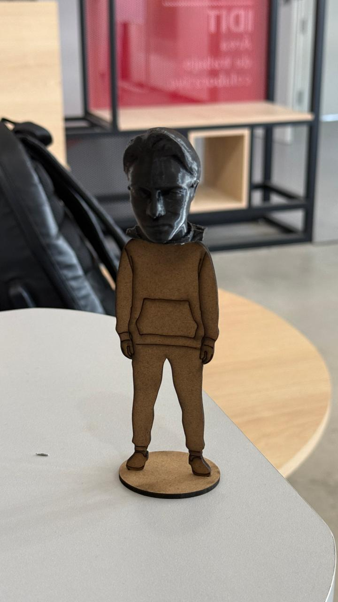
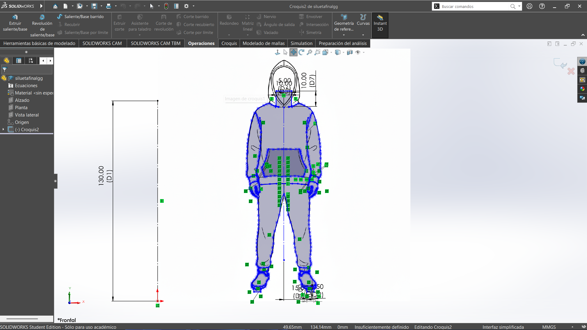

# Proyecto Final

El proyecto final consistió en la elaboración de una catapulta y una figura con temática de nosotros mismios usando varias tecnicas de creacion aprendidas a lo largo del curso (Impresión 3D  y Corte laser de MDF). La figura la hice en solidworks, además grabé para detallar más a mi silueta y después la exporté a dxf junto con la base. Cprté en laser y despues uní mi cabeza impresa en 3D y asi quedó mi figura:

