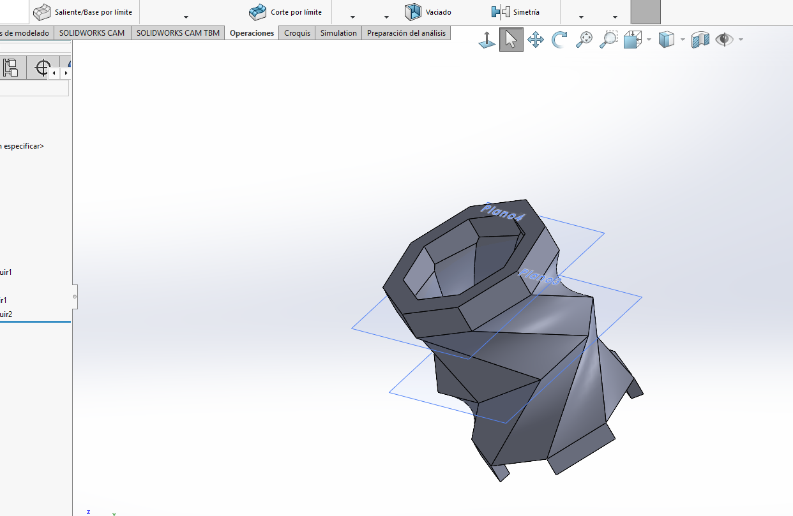

## Ejercicios SolidWorks
---
## Ejercicio 2
---

    <a href="../recursos/SOLID-BUENOS/Ejercicio%202%20Gerardo%20Esquivel.SLDPRT" target="_blank">[Descargar (SLDPRT)]</a>

---
## Ejercicio 5 Solidworks:
---

    <a href="../recursos/SOLID-BUENOS/Ejercicio%205%20Gerardo%20Esquivel.SLDPRT" target="_blank">[Descargar (SLDPRT)]</a>

---

## Ejercicio florero Solidworks:
---

    <a href="../recursos/macetas/EjercicioFlorero.SLDPRT" target="_blank">[Descargar (SLDPRT)]</a>

---
## 3 Macetas Solidworks:
---
- **Maceta 1**

    <a href="../recursos/macetas/Maceta1.SLDPRT" target="_blank">[Descargar (SLDPRT)]</a>

---
- **Maceta 2**

 

    <a href="../recursos/macetas/Maceta2.SLDPRT" target="_blank">[Descargar (SLDPRT)]</a>

---
- **Maceta 3**

  

    <a href="../recursos/macetas/Maceta3.SLDPRT" target="_blank">[Descargar (SLDPRT)]</a>

