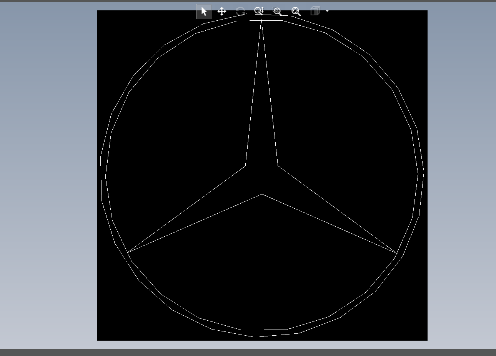
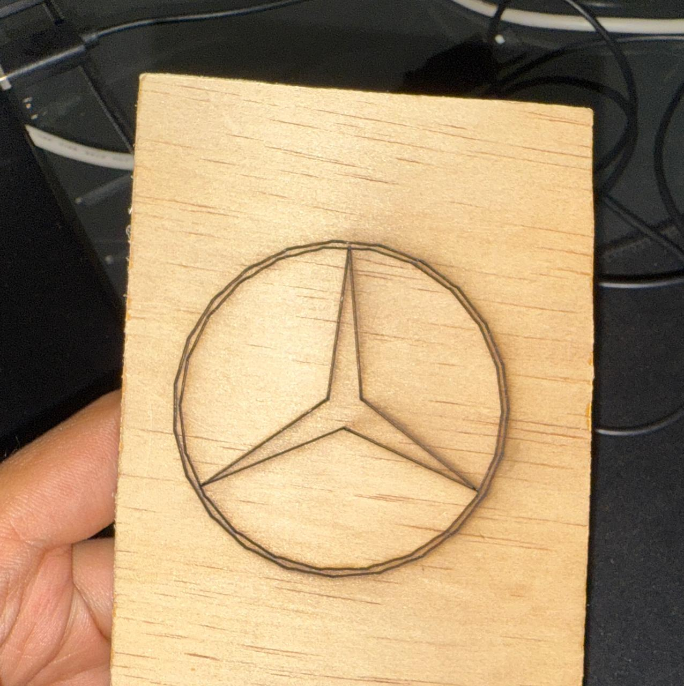
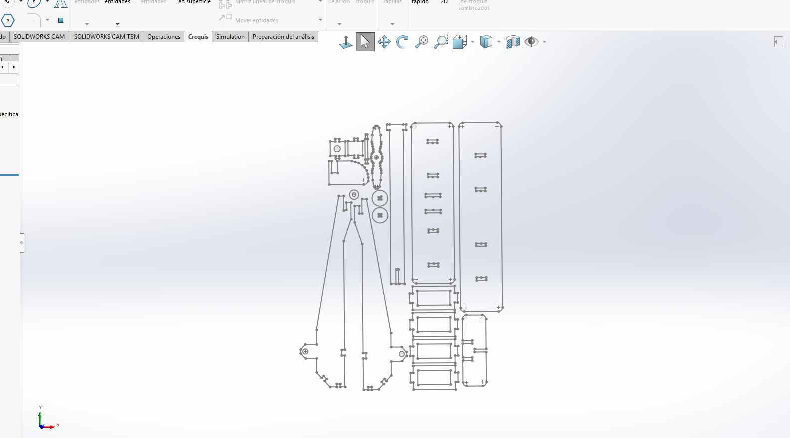
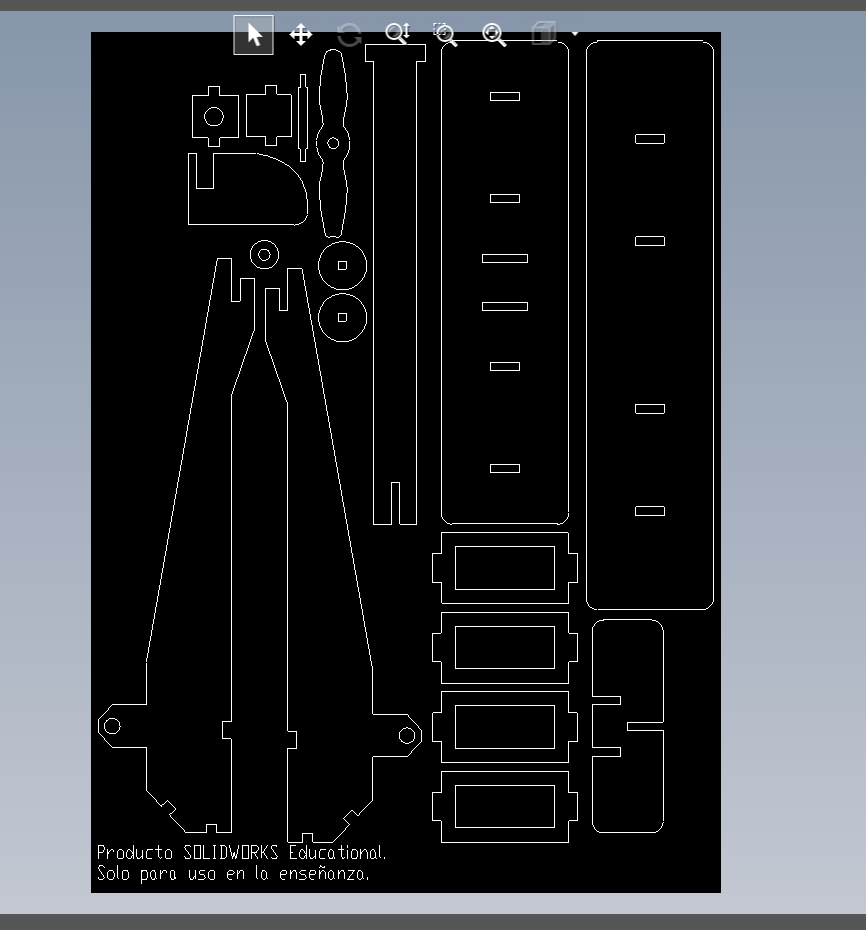
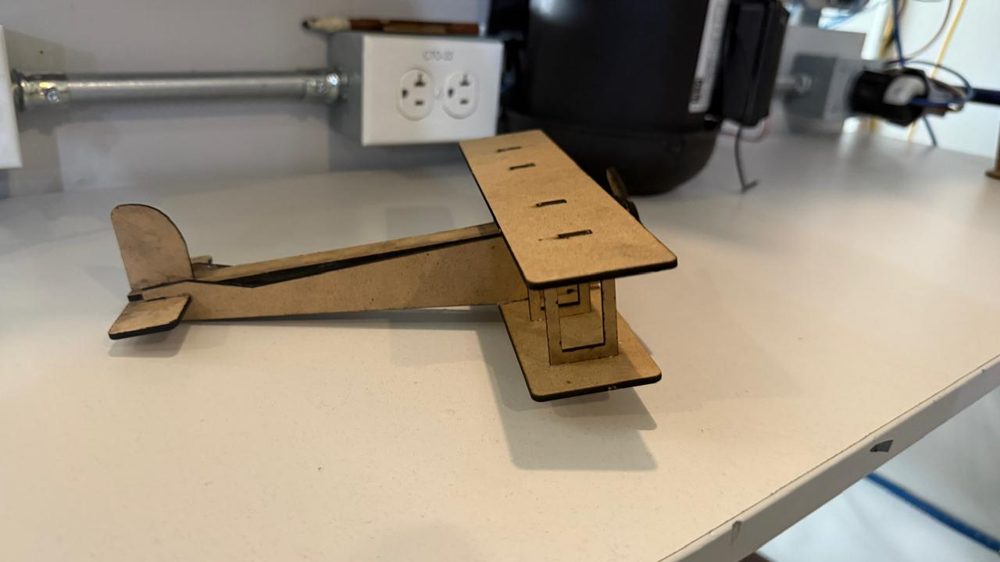
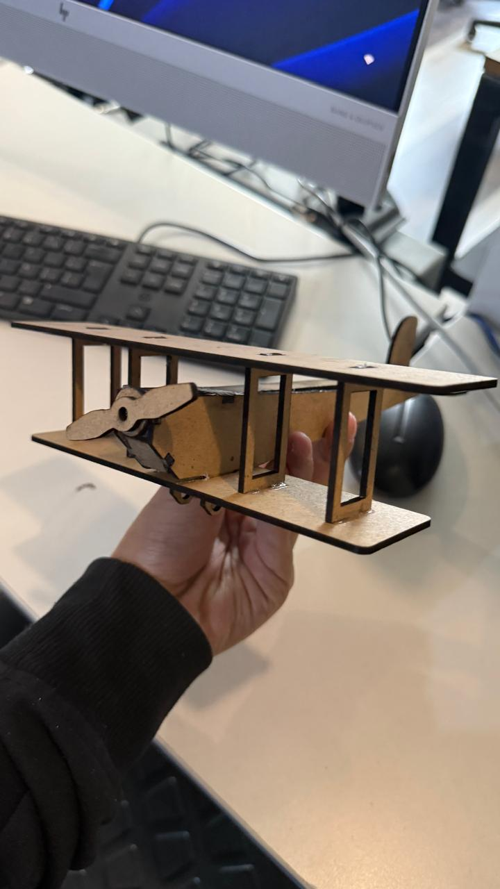

# Corte y grabado con máquina láser

# Grabado:

## Diseño en DXF
Se exporta en .DXF, que es el formato que se utiliza en la máquina láser, se coloca en el programa, se hacen pruebas de medida y se configuran parámetros de potencia y velocidad del láser y se manda a grabar.

[Descargar archivo de Corte Láser (.dxf)](recursos/logograbadogerardo.DXF)

## Resultado:

# Corte:
Para el corte busque ideas de figuras armadas en mdf, y quise hacer una avioneta, primero diseñém las piezas en SolidWorks, teniendo en cuenta el grosor del mdf (2 mm)

[Descargar archivo de SolidWorks (.SLDPRT)](recursos/AvionVector.SLDPRT)

## Diseño en DXF
Ahora lo exporto a formato .DXF para que tenga el formato adecuado para la cortadora

[Descargar archivo de Corte Láser (.dxf)](recursos/avion.DXF)

## Proceso de corte:
Puse los parámetros en la máquina y empezó a cortar

<video width="400" controls>
  <source src="../recursos/cortelaser.mp4" type="video/mp4">
</video>

## Resultado (ensamblaje):

