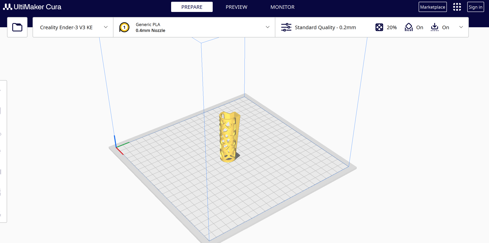

## Impresión 3D

La practica consistio en la elaboracion e impresion de un modelo 3D dificil de crear con otras formas de creacion, en mi caso hice una funda para encendedor CLIPPER, con agujeros irregulares.

    <a href="../recursos/IMPRESION/encendedor3D.stl" target="_blank">[Descargar (STL)]</a>

## Resultado

## Curso de fabricación digital

Consistió en tomar un curso en línea, en IDIT ACADEMY.

