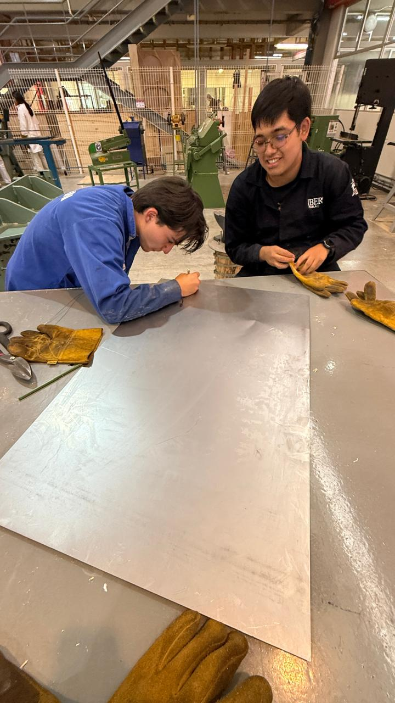
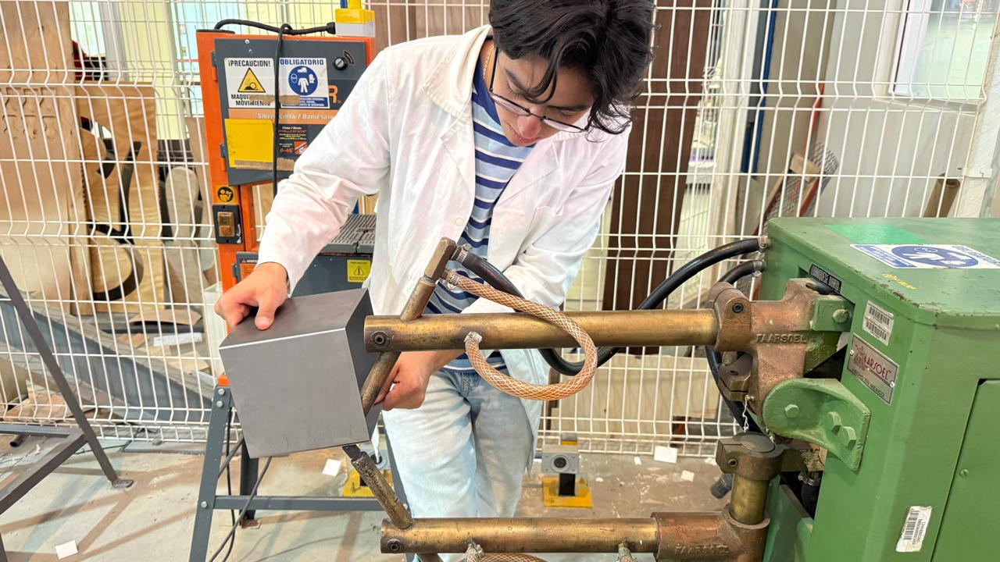
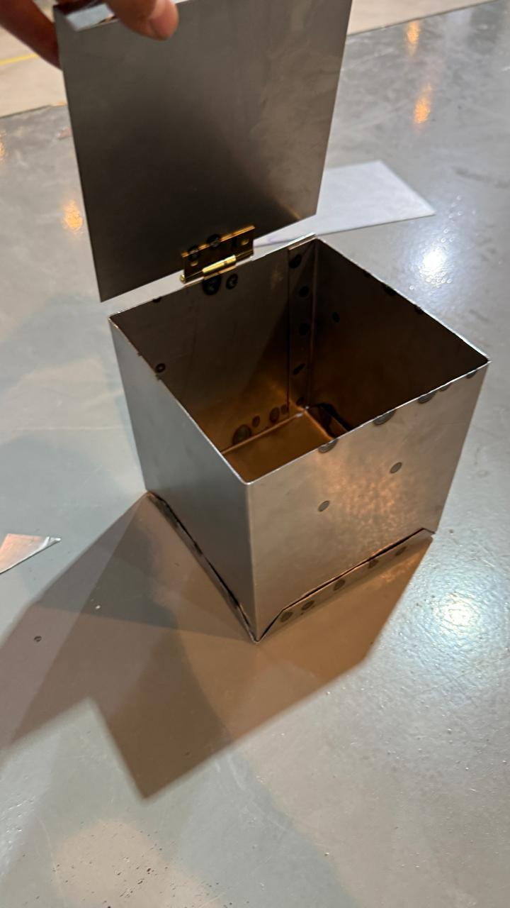

# Práctica 2 en el IDIT

En esta práctica aprendimos a usar máquinas para cortar lámina, doblarla y transformarla, se trabajó con lámina de acero negro de calibre 22, hicimos una caja de lámina utilizando la soldadura de punto para la unión y bisagras para la tapa.

## Trazando la caja

## Cortando la lámina

## Doblando la lámina

## Soldando

## Resultado

