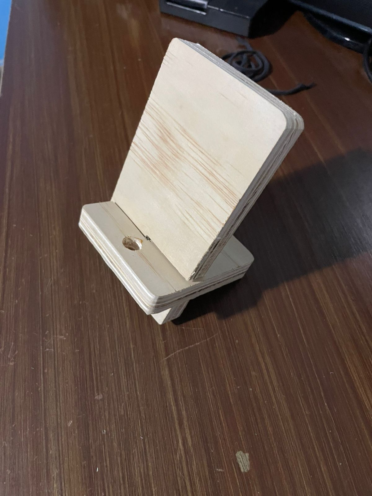
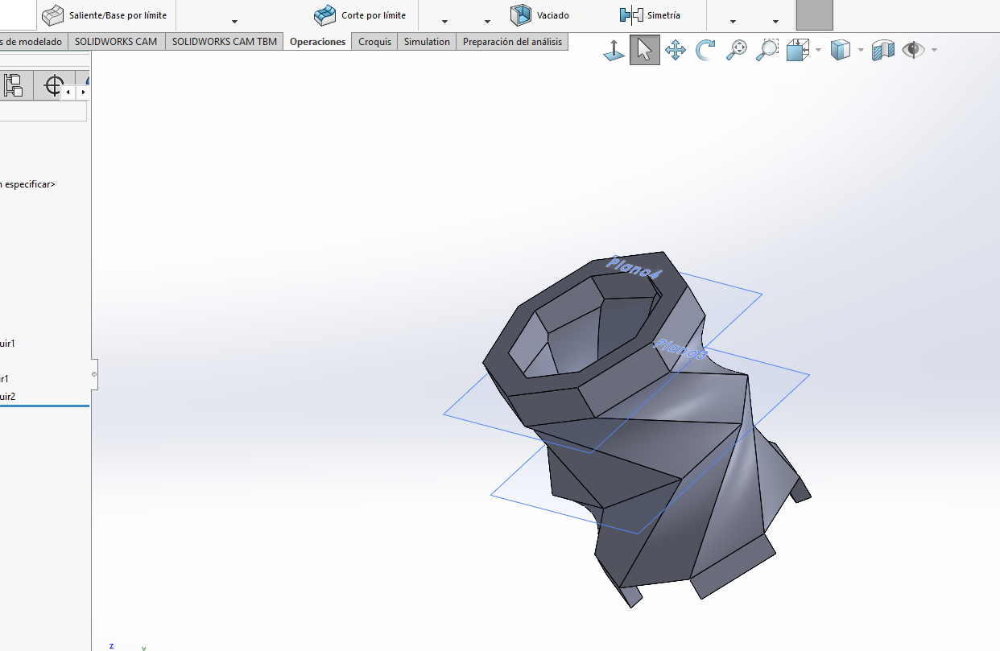
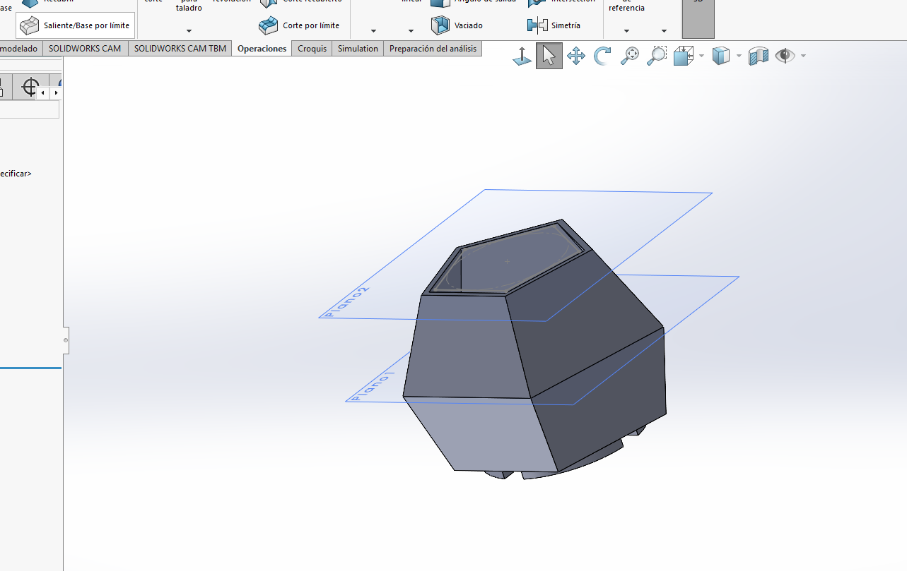
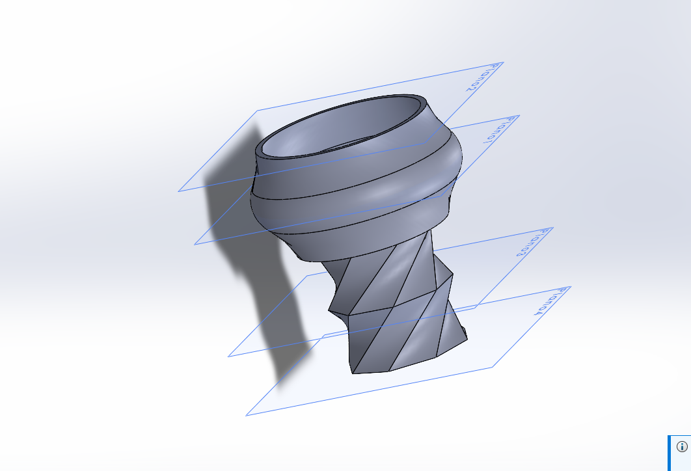

# Trabajos

##Trabajos realiazados:

##Porta celulares:

##Videos usando máquinas:

##-Ejercicio 1 Solidworks:

[Ejercicio 1 - abrir en OneDrive](https://iberopuebla-my.sharepoint.com/:u:/g/personal/204655_iberopuebla_mx/EWBl4jHbz4RNgMxER6b9eNQBFEurDA7G5h2rM6zumm4rmw?e=jkDMes "Abrir")

##-Ejercicio 2 Solidworks:

[Ejercicio 2 - abrir en OneDrive](https://iberopuebla-my.sharepoint.com/:u:/g/personal/204655_iberopuebla_mx/Ed8jhqfGd9hKiqUrl-jKElcB8v24usvNBnWIsZc72p19lQ?e=3hKL4Q "Abrir")

##-Ejercicio 5 Solidworks:

[Ejercicio 5 - abrir en OneDrive](https://iberopuebla-my.sharepoint.com/:u:/g/personal/204655_iberopuebla_mx/EdaDr198lUpBtvit8yMKs0gBoobjIiSexnizYv53iuPW3Q?e=IneyAa "Abrir")

##-Ejercicio florero Solidworks:

[Ejercicio florero - abrir en OneDrive](https://iberopuebla-my.sharepoint.com/:u:/g/personal/204655_iberopuebla_mx/EVYk4CmO-Q5Jj1Pv7fRBnNkB0_ryyG8IQQ1R-w_VbFL9GA?e=spguOh "Abrir")

##-3 Macetas Solidworks:
- Maceta 1

[Maceta 1 - abrir en OneDrive](https://iberopuebla-my.sharepoint.com/:u:/g/personal/204655_iberopuebla_mx/EeM6-dyUBuJJpL_5Y8nArjcBuS9ZAmYz12bVy_Ac0i2H0g?e=Ny56Tc "Abrir")
- Maceta 2

[Maceta 2 - abrir en OneDrive](https://iberopuebla-my.sharepoint.com/:u:/g/personal/204655_iberopuebla_mx/EZHI_jAu4SNIm3_IH5WUaigBzMwYuvfIDhGa7sHq-PDPOA?e=sxV5kg "Abrir")
- Maceta 3

[Maceta 3 - abrir en OneDrive](https://iberopuebla-my.sharepoint.com/:u:/g/personal/204655_iberopuebla_mx/EQF4h_CIcT9IpUT4zJFWjZABkaXDQdP8xBnC9MlXkx-Oxw?e=uqa5Fp "Abrir")

